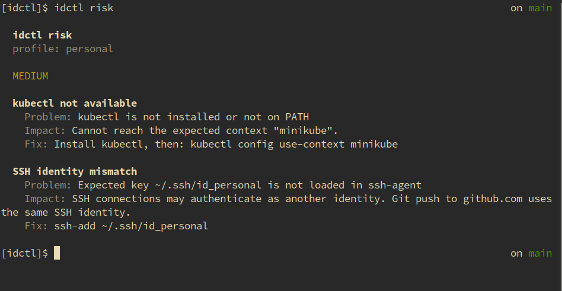

# idctl

Ever committed code with the wrong Git identity?

Ever deployed to the wrong AWS account?

Ever wondered which SSH key your terminal will actually use?

`idctl` is a read-only CLI that inspects your runtime identity context across Git, AWS, Kubernetes and SSH, then highlights mismatches and risks before they become mistakes.

## Example

```bash
idctl risk
```

<p align="center">
  
</p>
<p align="center"><sub>Actionable findings only — no healthy-system noise.</sub></p>

Only problems are shown, grouped by severity, each with **Problem**, **Impact**, and **Fix**.

## Why?

Modern developer environments contain multiple identities:

* Git accounts
* AWS profiles
* Kubernetes contexts
* SSH keys

`idctl` helps you understand which identity is actually active right now.

## Install

*Option 1: go install**
```bash
go install github.com/voyager556321/idctl/cmd/idctl@latest
```

**Option 2: Download binary**

Grab the latest Linux/macOS binary from [Releases](https://github.com/voyager556321/idctl/releases).

## Quick start

```bash
idctl risk     # show mismatches and risks
idctl status   # show full identity snapshot
```
